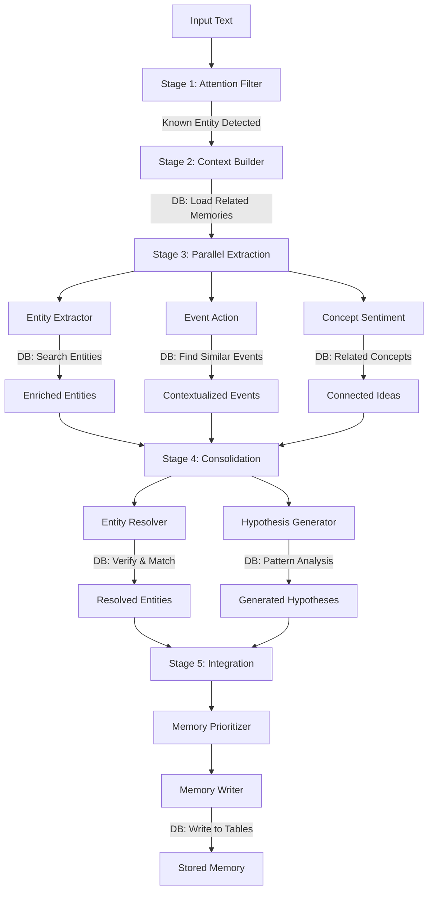

# B4 Agent Waterfall Architecture
## 9 Specialized Agents with Database Integration

*Version 1.0 - Implementation Design Document*

---

## 📋 Executive Summary

This document defines the implementation architecture for B4's memory waterfall using 9 specialized agents across 5 cognitive stages. Each agent integrates with BigQuery to enrich extractions with existing knowledge, creating a comprehensive memory formation pipeline.

**Core Principle**: "Extract → Search Database → Enrich → Connect → Store"

---

## 🏗️ Architecture Overview

### **9 Core Agents Across 5 Stages**

```yaml
STAGE 1: ATTENTION (1 Agent)
├── attention_filter       # Fast triage & relevance scoring

STAGE 2: PERCEPTION (1 Agent)
├── context_builder        # Context awareness & memory priming

STAGE 3: COMPREHENSION (3 Agents - Parallel)
├── entity_extractor       # WHO/WHAT - People, Orgs, Places, Products
├── event_action          # WHAT HAPPENED/TODO - Events, Tasks, Actions
└── concept_sentiment     # WHAT IT MEANS/FEELS - Ideas, Sentiments, Stances

STAGE 4: CONSOLIDATION (2 Agents)
├── entity_resolver       # Match to existing + contradiction detection
└── hypothesis_generator  # Handle uncertainty + pattern recognition

STAGE 5: INTEGRATION (2 Agents)
├── memory_prioritizer    # Decide what/how to remember
└── memory_writer        # Write to BigQuery + build relationships
```

---

## 🔄 Processing Flow with Database Integration

### **Example Input**: "Elon Musk said we will be on Mars in 2030"



---

## 📊 Database Integration Pattern

### **Three-Step Process for Each Agent**

```python
# STEP 1: Extract from Input
raw_extraction = extract_from_text(input_text)
# Example: "Elon Musk" → {text: "Elon Musk", type: "PERSON"}

# STEP 2: Search Database
database_results = search_bigquery(raw_extraction)
# Example: Returns {id: "person_123", summary: "CEO of SpaceX", ...}

# STEP 3: Combine & Understand
enriched_result = combine_and_contextualize(raw_extraction, database_results)
# Example: "SpaceX CEO making Mars prediction" → Store in quotes, predictions
```

---

## 🤖 Agent Specifications

### **Stage 1: ATTENTION**

#### **Agent: `attention_filter`**

**Purpose**: Fast triage to avoid wasting resources on irrelevant content

**Models**:
- Primary: Regex/Rules (FREE)
- Fallback: gpt-oss-20b (CHEAP - $0.03/1M tokens)

**Database Integration**:
```python
# Pre-loads top 1000 entities for fast pattern matching
cached_entities = """
    SELECT id, title, aliases
    FROM `bthree-476203.brain_data.core_entities`
    ORDER BY access_info.access_count DESC
    LIMIT 1000
"""
```

**Input/Output Structure**:
```json
{
  "input": {
    "text": "string",
    "metadata": {"source": "string", "timestamp": "datetime"}
  },
  "output": {
    "should_process": true,
    "relevance_score": 0.8,
    "importance_score": 0.7,
    "detected_domains": ["tech", "business"],
    "known_entity_hints": ["person_elon_musk_123"],
    "skip_reason": null
  }
}
```

---

### **Stage 2: PERCEPTION**

#### **Agent: `context_builder`**

**Purpose**: Establish contextual frame and load related memories

**Models**:
- Primary: gemini-2.0-flash-lite ($0.10/1M tokens)
- Escalation: gemini-2.0-flash ($0.30/1M tokens)

**Database Integration**:
```python
# Finds similar past contexts and related entities
similar_contexts_query = """
    SELECT c.id, c.situation,
           ARRAY_AGG(STRUCT(e.id, e.title, e.type)) as entities
    FROM contexts c
    JOIN core_entities e ON c.id = e.context_id
    WHERE e.id IN UNNEST(@known_entities)
    GROUP BY c.id, c.situation
    LIMIT 5
"""
```

**Input/Output Structure**:
```json
{
  "output": {
    "context_id": "ctx_20241116_001",
    "source_context": {
      "type": "news",
      "platform": "twitter",
      "credibility": 0.8
    },
    "temporal_context": {
      "published": "2024-11-16T10:00:00Z",
      "references": ["future"],
      "urgency": "low"
    },
    "memory_hints": {
      "entities": [
        {"id": "person_123", "name": "Elon Musk", "summary": "CEO of SpaceX"}
      ],
      "previous_events": ["2016 Mars prediction", "2023 Starship test"]
    }
  }
}
```

---

### **Stage 3: COMPREHENSION (Parallel)**

#### **Agent: `entity_extractor`**

**Purpose**: Extract and enrich all entities with database knowledge

**Models**:
- Primary: gpt-oss-20b ($0.03/1M tokens)
- Escalation: gemini-2.0-flash ($0.30/1M tokens)

**Database Integration**:
```python
# For each extracted entity, search for matches
entity_search = """
    SELECT id, title, type, summary, aliases,
           CASE
               WHEN LOWER(title) = LOWER(@entity_text) THEN 1.0
               WHEN @entity_text IN UNNEST(aliases) THEN 0.9
               ELSE 0.7
           END as match_score
    FROM core_entities
    WHERE type = @entity_type
      AND (LOWER(title) LIKE '%' || @entity_text || '%'
           OR @entity_text IN UNNEST(aliases))
    ORDER BY match_score DESC
    LIMIT 5
"""
```

**Output Structure**:
```json
{
  "entities": [
    {
      "text": "Elon Musk",
      "type": "PERSON",
      "confidence": 0.95,
      "likely_existing_id": "person_elon_musk_123",
      "from_database": {
        "summary": "CEO of SpaceX and Tesla",
        "related_orgs": ["SpaceX", "Tesla", "Neuralink"],
        "last_seen": "2024-11-15"
      }
    }
  ]
}
```

#### **Agent: `event_action`**

**Purpose**: Extract events and actionable tasks

**Models**:
- Primary: gemini-2.0-flash-lite ($0.10/1M tokens)
- Escalation: gemini-2.0-flash ($0.30/1M tokens)

**Database Integration**:
```python
# Find similar past events
similar_events = """
    SELECT id, event_type, participants, outcome
    FROM events
    WHERE participants @> [@entity_id]
      AND event_type = @event_type
    ORDER BY occurred_at DESC
    LIMIT 10
"""
```

#### **Agent: `concept_sentiment`**

**Purpose**: Extract ideas, concepts, and emotional tone

**Models**:
- Primary: gpt-oss-20b ($0.03/1M tokens)
- Escalation: gpt-oss-120b ($0.05/1M tokens for complex ideas)

---

### **Stage 4: CONSOLIDATION**

#### **Agent: `entity_resolver`**

**Purpose**: Match entities to existing records and detect contradictions

**Models**:
- Primary: gemini-2.0-flash ($0.30/1M tokens)

**Database Integration**:
```python
# Relationship-based inference
# Example: "The CEO" + "SpaceX mentioned" → Elon Musk
inference_query = """
    SELECT p.id, p.title, pr.relationship_type
    FROM people_relationships pr
    JOIN people_core p ON pr.source_person_id = p.id
    WHERE pr.target_entity_id = @org_id
      AND pr.relationship_type IN ('ceo_of', 'founder_of')
    ORDER BY pr.confidence DESC
    LIMIT 1
"""
```

**Resolution Strategies**:
1. **Direct Match**: Exact name/alias match (confidence > 0.9)
2. **Fuzzy Match**: Similar names with context validation (confidence 0.7-0.9)
3. **Relationship Inference**: Role-based resolution (confidence 0.6-0.8)
4. **New Entity**: No matches found (confidence 0.0)

#### **Agent: `hypothesis_generator`**

**Purpose**: Generate hypotheses for uncertain connections and detect patterns

**Models**:
- Primary: gemini-2.0-flash ($0.30/1M tokens)
- Escalation: gpt-oss-120b ($0.05/1M tokens)

**Pattern Detection**:
```python
# Detect recurring patterns
pattern_query = """
    SELECT pattern_type, COUNT(*) as occurrences
    FROM (
        SELECT 'prediction' as pattern_type
        FROM events
        WHERE subject_id = @entity_id
          AND event_type = 'prediction'
    )
    GROUP BY pattern_type
    HAVING COUNT(*) > 2
"""
```

---

### **Stage 5: INTEGRATION**

#### **Agent: `memory_prioritizer`**

**Purpose**: Decide what deserves long-term memory

**Models**:
- Primary: gpt-oss-20b ($0.03/1M tokens)

**Priority Levels**:
- **Level 1**: Store immediately with full indexing
- **Level 2**: Store with basic indexing
- **Level 3**: Store compressed
- **Level 4**: Skip (not memorable)

#### **Agent: `memory_writer`**

**Purpose**: Write to BigQuery tables with relationships

**Models**:
- Primary: gemini-2.0-flash-lite ($0.10/1M tokens)

**Database Writes**:
```python
# Write to multiple tables
tables_to_update = [
    'core_entities',      # New or updated entities
    'events',            # New events
    'knowledge_facts',   # Extracted facts
    'entity_links',      # New relationships
    'hypotheses',        # Uncertain connections
    'tasks'             # Action items
]
```

---

## 🔧 Required Tools and Services

### **1. BigQueryTool**
```python
class BigQueryTool:
    """Centralized BigQuery access for all agents"""

    async def query(sql: str, params: dict = None) -> List[Dict]
    async def insert(table: str, records: List[Dict]) -> bool
    async def update(table: str, record_id: str, updates: dict) -> bool
```

### **2. EmbeddingTool**
```python
class EmbeddingTool:
    """Generate embeddings for similarity search"""

    async def generate(text: str) -> List[float]
    async def batch_generate(texts: List[str]) -> List[List[float]]
```

### **3. EntityCacheTool**
```python
class EntityCacheTool:
    """Fast cache for frequently accessed entities"""

    def __init__(self):
        self.cache = {}  # In-memory cache
        self.ttl = 3600  # 1 hour TTL

    async def get_entity(entity_id: str) -> Dict
    async def search_entities(query: str) -> List[Dict]
    async def refresh_cache() -> None
```

### **4. CostTracker**
```python
class CostTracker:
    """Track API costs across all agents"""

    COSTS = {
        'regex': 0.0,
        'gpt-oss-20b': 0.00003,
        'gemini-flash-lite': 0.0001,
        'gemini-flash': 0.0003,
        'gpt-oss-120b': 0.00005,
        'gemini-pro': 0.00125
    }

    def add_cost(agent: str, model: str, tokens: int)
    def get_total_cost() -> float
    def get_breakdown() -> Dict[str, float]
```

---

## 💰 Cost Optimization Strategy

### **Model Selection by Cost**

| Model | Input Cost | Output Cost | Use Case |
|-------|------------|-------------|----------|
| Regex/Rules | $0 | $0 | Pattern matching |
| gpt-oss-20b | $0.03/1M | $0.14/1M | Basic extraction |
| gemini-flash-lite | $0.10/1M | $0.40/1M | Simple reasoning |
| gemini-flash | $0.30/1M | $2.50/1M | Moderate complexity |
| gpt-oss-120b | $0.05/1M | $0.24/1M | Complex reasoning |
| gemini-pro | $1.25/1M | $15/1M | Critical decisions |

### **Escalation Rules**

```python
def should_escalate(confidence: float, importance: float, cost_so_far: float):
    # Never escalate if confident
    if confidence > 0.8:
        return False

    # Check budget
    if cost_so_far > daily_budget * 0.8:
        return False

    # Escalate if important and uncertain
    if importance > 0.7 and confidence < 0.6:
        return True

    return False
```

---

## 📈 Processing Example: Complete Flow

### **Input**: "Elon Musk said we will be on Mars in 2030"

#### **Stage 1: Attention Filter**
```json
{
  "detected": "Elon Musk (cached entity)",
  "relevance": 0.9,
  "proceed": true
}
```

#### **Stage 2: Context Builder**
```json
{
  "loaded_memories": [
    "Elon Musk - CEO of SpaceX",
    "Previous Mars predictions: 2024, 2026",
    "SpaceX Starship development"
  ]
}
```

#### **Stage 3: Entity Extraction (Enriched)**
```json
{
  "Elon Musk": {
    "id": "person_123",
    "from_db": "CEO of SpaceX, Tesla",
    "confidence": 0.95
  },
  "Mars": {
    "id": "place_456",
    "from_db": "Fourth planet, colonization target",
    "confidence": 1.0
  }
}
```

#### **Stage 4: Resolution & Patterns**
```json
{
  "pattern_detected": "Elon's timeline predictions shift +2-3 years",
  "hypothesis": "Actual Mars mission likely 2032-2033"
}
```

#### **Stage 5: Memory Storage**
```json
{
  "stored_in": [
    "events (prediction)",
    "knowledge_facts (Mars 2030)",
    "entity_links (Elon->predicts->Mars)"
  ],
  "enrichment": "Contextualized with SpaceX role and prediction history"
}
```

---

## 🚀 Implementation Priorities

### **Phase 1: Core Pipeline (Week 1)**
1. Implement `attention_filter` with entity cache
2. Create `context_builder` with BigQuery integration
3. Build `entity_extractor` with database search

### **Phase 2: Enrichment (Week 2)**
4. Add `event_action` and `concept_sentiment`
5. Implement `entity_resolver` with multiple strategies
6. Create `hypothesis_generator`

### **Phase 3: Storage (Week 3)**
7. Build `memory_prioritizer`
8. Implement `memory_writer` with relationship creation
9. Add orchestrator for complete pipeline

### **Phase 4: Optimization (Week 4)**
10. Add cost tracking
11. Implement smart escalation
12. Performance tuning and caching

---

## 📝 Implementation Notes

1. **Parallel Processing**: Stage 3 agents run simultaneously using `asyncio.gather()`
2. **Caching Strategy**: Cache top 1000 entities in memory, refresh hourly
3. **Error Handling**: Each agent should gracefully handle database failures
4. **Monitoring**: Track cost, latency, and accuracy for each agent
5. **Testing**: Each agent should be independently testable

---

## 🔗 Related Documents

- [B4_MEMORY_WATERFALL_DESIGN.md](B4_MEMORY_WATERFALL_DESIGN.md) - Overall waterfall architecture
- [B4_EXTRACTION_PIPELINE_SPEC.md](B4_EXTRACTION_PIPELINE_SPEC.md) - Technical pipeline specification
- [ai_models.txt](ai_models.txt) - Model pricing and capabilities

---

## 📊 Success Metrics

- **Extraction Accuracy**: >85% entity resolution accuracy
- **Cost Efficiency**: <$0.10 per 1000 inputs average
- **Processing Speed**: <2 seconds for standard input
- **Database Enrichment**: >70% of entities matched to existing knowledge
- **Pattern Detection**: Identify recurring patterns with >60% accuracy

---

*Last Updated: November 2024*